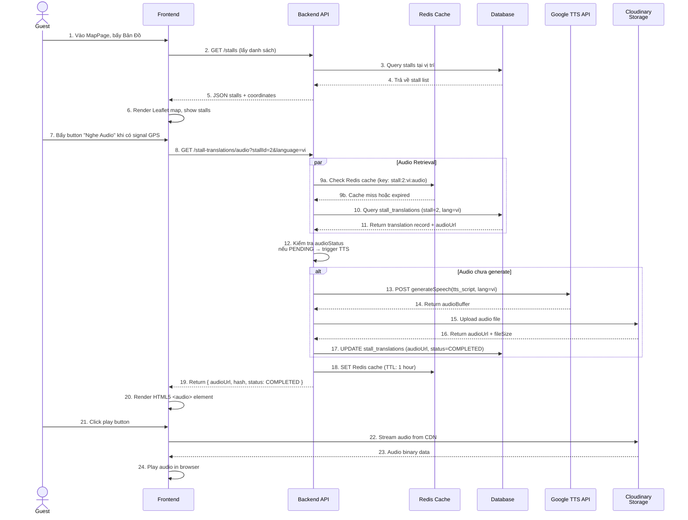
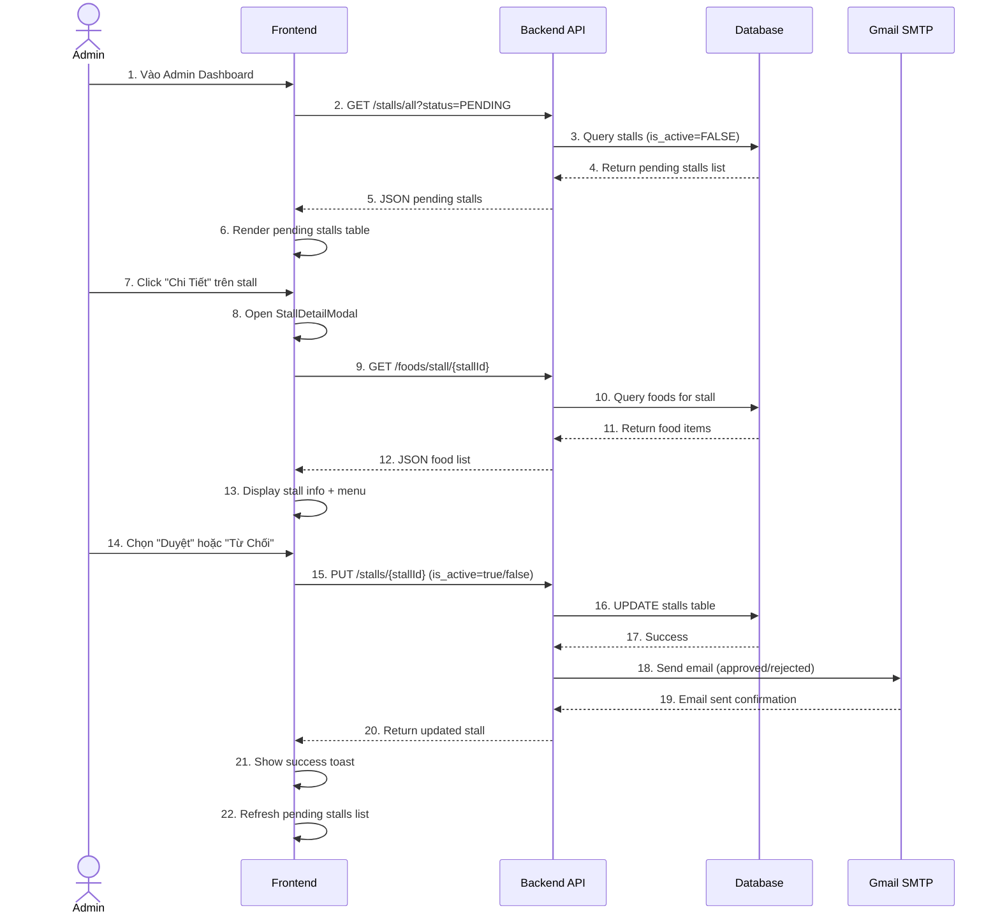
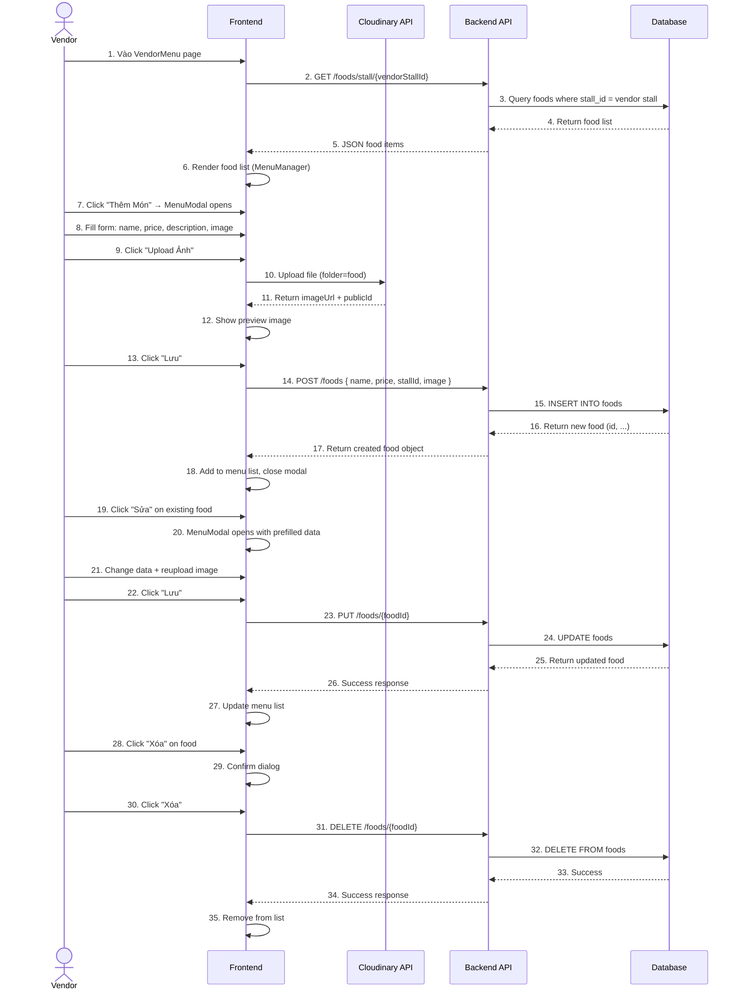
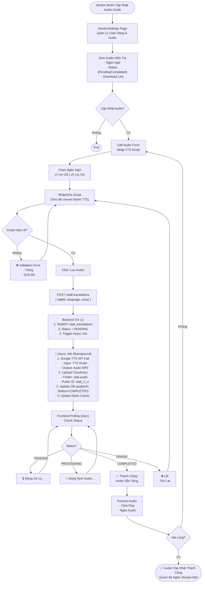
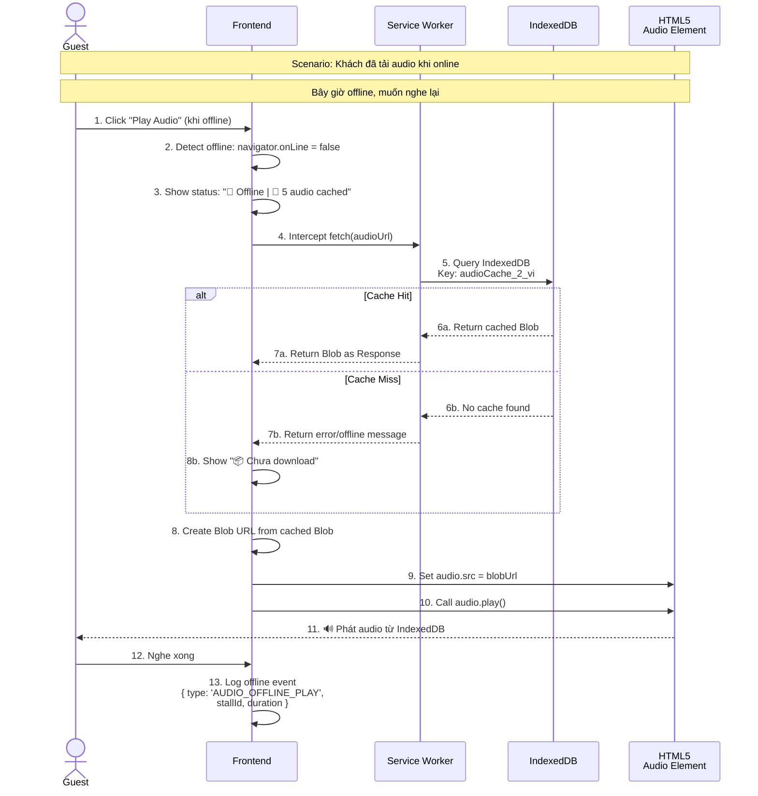
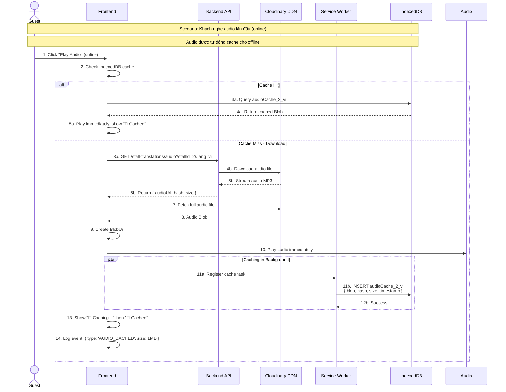

# PRODUCT REQUIREMENTS DOCUMENT (PRD)
## SmartFoodStreet - Hệ Thống Quản Lý Phố Ẩm Thực Thông Minh

---

## PHẦN 1: TỔNG QUAN DỰ ÁN

### 1.1 Tên Dự Án
**SmartFoodStreet** - Hệ thống Quản lý Giới thiệu Phố Ẩm Thực Thông Minh

### 1.2 Mục Tiêu Business
- **Mục tiêu chính:** Xây dựng nền tảng kỹ thuật để quản lý và giới thiệu phố ẩm thực (food street) theo phương pháp hiện đại
- **Giá trị cốt lõi:**
  - Cung cấp trải nghiệm khám phá ẩm thực tương tác thông qua bản đồ GPS và quét QR
  - Hỗ trợ đa ngôn ngữ (Tiếng Việt, English, 中文, 日本語, 한국어) để thu hút khách quốc tế
  - Tối ưu hóa trải nghiệm khách hàng bằng audio guide (TTS - Text-To-Speech) tự động
  - Cung cấp công cụ quản lý cho chủ gian hàng (vendor) theo dõi doanh số và quản lý menu
  - Công cụ quản trị toàn diện cho admin quản lý hệ thống

### 1.3 Đối Tượng Người Dùng (User Personas)
| Đối Tượng | Mô Tả | Nhu Cầu Chính |
|-----------|-------|--------------|
| **Khách Tham Quan (Guest)** | Khách du lịch, người dân địa phương muốn khám phá phố ẩm thực | Xem danh sách gian hàng, tìm kiếm, nghe audio guide, quét QR |
| **Chủ Gian Hàng (Vendor)** | Chủ quán ăn, chủ gian hàng tham gia vào hệ thống | Quản lý menu, xem doanh số, cập nhật thông tin gian hàng, quản lý audio guide |
| **Quản Trị Viên (Admin)** | Người quản lý hệ thống, duyệt gian hàng mới | Duyệt gian hàng, quản lý người dùng, tạo mã QR, cấu hình trigger geofence, xem thống kê |

### 1.4 Phạm Vi Và Giới Hạn

**Phạm Vi Bao Gồm:**
- Hiển thị danh sách gian hàng ẩm thực
- Bản đồ tương tác với GPS tracking
- Quét mã QR gateway
- Audio guide đa ngôn ngữ (TTS + Human-like)
- Quản lý menu (thêm, sửa, xóa)
- Dashboard thống kê cho vendor
- Dashboard quản trị cho admin
- Hệ thống xác thực (JWT-based)
- Hệ thống trigger geofence (radius-based)
- Analytics & tracking (visit events, QR scans)

**Giới Hạn Hiện Tại:**
- Hỗ trợ 1 khu phố ẩm thực (Phố Vĩnh Khánh, Quận 4, TP.HCM)
- Geofence trigger: radius 25-30m (configurable)
- Tối đa 20MB cho upload hình ảnh
- Không hỗ trợ thanh toán online
- Không hỗ trợ booking/reservation

---

## PHẦN 2: SƠ ĐỒ

### 2.1 USE CASE DIAGRAM

```mermaid
graph TD
    subgraph Actors
        A[👤 Guest - Khách Tham Quan]
        V[👥 Vendor - Chủ Gian Hàng]
        AD[🛡️ Admin - Quản Trị Viên]
        SYS[⚙️ Hệ Thống Ngoài]
    end
    
    subgraph GuestUC["Guest Use Cases"]
        UC1["Xem Danh Sách Gian Hàng"]
        UC2["Tìm Kiếm & Lọc Gian Hàng"]
        UC3["Xem Chi Tiết Menu"]
        UC4["Xem Bản Đồ GPS"]
        UC5["Nghe Audio Guide"]
        UC6["Quét Mã QR"]
        UC7["Xem Thông Tin Gian Hàng"]
    end
    
    subgraph VendorUC["Vendor Use Cases"]
        UC8["Đăng Ký Gian Hàng"]
        UC9["Quản Lý Menu"]
        UC10["Cập Nhật Thông Tin Gian Hàng"]
        UC11["Quản Lý Audio Guide"]
        UC12["Xem Doanh Số"]
        UC13["Xem Analytics"]
        UC14["Cập Nhật Vị Trí GPS"]
    end
    
    subgraph AdminUC["Admin Use Cases"]
        UC15["Duyệt Gian Hàng Mới"]
        UC16["Quản Lý Tài Khoản"]
        UC17["Tạo & Quản Lý Mã QR"]
        UC18["Cấu Hình POI & Trigger"]
        UC19["Xem Dashboard Thống Kê"]
        UC20["Quản Lý Gian Hàng"]
        UC21["Export Report"]
    end
    
    %% Guest connections
    A -->|Sử Dụng| UC1
    A -->|Sử Dụng| UC2
    A -->|Sử Dụng| UC3
    A -->|Sử Dụng| UC4
    A -->|Sử Dụng| UC5
    A -->|Sử Dụng| UC6
    A -->|Sử Dụng| UC7
    
    %% Vendor connections
    V -->|Sử Dụng| UC8
    V -->|Sử Dụng| UC9
    V -->|Sử Dụng| UC10
    V -->|Sử Dụng| UC11
    V -->|Sử Dụng| UC12
    V -->|Sử Dụng| UC13
    V -->|Sử Dụng| UC14
    
    %% Admin connections
    AD -->|Sử Dụng| UC15
    AD -->|Sử Dụng| UC16
    AD -->|Sử Dụng| UC17
    AD -->|Sử Dụng| UC18
    AD -->|Sử Dụng| UC19
    AD -->|Sử Dụng| UC20
    AD -->|Sử Dụng| UC21
    
    %% System connections
    SYS -->|Gọi| UC5
    SYS -->|Gọi| UC11
```



### 2.2 SEQUENCE DIAGRAM - Luồng Chính: Khách Tham Quan Xem Audio Guide



### 2.3 SEQUENCE DIAGRAM - Admin Duyệt Gian Hàng Mới



### 2.4 SEQUENCE DIAGRAM - Vendor Quản Lý Menu



### 2.5 ACTIVITY DIAGRAM - Luồng Chính Khách Tham Quan

```mermaid
graph TD
    Start([👤 Khách Tham Quan Vào Phố Ẩm Thực]) --> LandingPage["LandingPage<br/>Hiển Thị QR Gateway"]
    
    LandingPage --> Decision1{Chọn Hành Động?}
    
    Decision1 -->|Bấy 'Khám Phá Ngay'| Home["Home Page<br/>Danh Sách Gian Hàng"]
    Decision1 -->|Quét QR| Scan["Quét QR Code"]
    
    %% Home flow
    Home --> Search["Tìm Kiếm & Lọc<br/>- Tên gian hàng<br/>- Danh mục<br/>- Giá"]
    Search --> SelectStall["Chọn Gian Hàng"]
    SelectStall --> StallDetail["StallDetail Page<br/>Xem Menu"]
    StallDetail --> BrowseFood["Duyệt Thực Đơn<br/>Xem Giá & Mô Tả"]
    
    %% Map flow
    Home --> MapChoice["Bấy 'Bản Đồ'"]
    MapChoice --> MapPage["MapPage<br/>Bản Đồ GPS Tương Tác"]
    MapPage --> GPS["Hệ Thống GPS<br/>- Lấy vị trí hiện tại<br/>- So sánh với Geofence"]
    
    GPS --> InGeofence{Nằm Trong<br/>Geofence?}
    InGeofence -->|Có| AutoAudio["🔊 Trigger Audio<br/>Tự Động Phát"]
    InGeofence -->|Không| Manual["Bấy 'Nghe Audio'<br/>Thủ Công"]
    
    AutoAudio --> AudioGen["TTS Generation (Async)<br/>- Text → Google TTS<br/>- Upload Cloudinary<br/>- Cache Redis"]
    Manual --> AudioGen
    
    AudioGen --> AudioPlay["Nghe Audio Guide<br/>- Định Dạng: MP3<br/>- Đa Ngôn Ngữ"]
    
    AudioPlay --> ViewStall["Xem Chi Tiết Gian Hàng"]
    ViewStall --> Decision2{Thích?}
    
    Decision2 -->|Có| Contact["📞 Liên Hệ<br/>- Xem SĐT<br/>- Xem Địa Chỉ"]
    Decision2 -->|Không| MapPage
    
    %% QR flow
    Scan --> QRScan["Quét Mã QR"]
    QRScan --> QRResult["Xử Lý QR Result<br/>- Increment scan count<br/>- Log visit event"]
    QRResult --> Redirect["Redirect đến<br/>Stall Detail hoặc<br/>Home"]
    
    %% Analytics flow
    MapPage --> Analytics["📊 Tracking Event<br/>- ENTER_GEOFENCE<br/>- AUDIO_START<br/>- VIEW_DETAIL"]
    StallDetail --> Analytics
    
    %% End
    Contact --> End(["✅ Trải Nghiệm Kết Thúc<br/>Dữ Liệu Được Lưu"])
    MapPage --> End
    
    %% Styles
    classDef start fill:#90EE90
    classDef process fill:#87CEEB
    classDef decision fill:#FFD700
    classDef end fill:#FFB6C6
    
    class Start start
    class End end
    class Decision1 decision
    class Decision2 decision
    class InGeofence decision
```

### 2.6 ACTIVITY DIAGRAM - Vendor Cập Nhật Audio Guide



### 2.7 SEQUENCE DIAGRAM - Offline Audio Playback (Khách Offline)



### 2.8 SEQUENCE DIAGRAM - Offline Audio Download & Cache (Khách Online)



### 2.9 ER DIAGRAM - Database Schema

```mermaid
erDiagram
    ACCOUNTS {
        bigint id PK "Primary Key"
        string username UK "Unique"
        string password
        string full_name
        string email UK
        boolean is_active
        datetime created_at
    }
    
    ROLES {
        bigint id PK
        string name UK "ADMIN, VENDOR, USER"
        string description
    }
    
    PERMISSIONS {
        bigint id PK
        string name UK
        string description
    }
    
    ACCOUNT_ROLES {
        bigint account_id PK,FK
        bigint role_id PK,FK
    }
    
    ROLE_PERMISSIONS {
        bigint role_id PK,FK
        bigint permission_id PK,FK
    }
    
    INVALIDATED_TOKENS {
        string token_id PK
        datetime expiry_time
    }
    
    FOOD_STREETS {
        bigint id PK
        string name
        text description
        string address
        string city
        decimal latitude
        decimal longitude
        boolean is_active
        datetime created_at
        datetime updated_at
    }
    
    STALLS {
        bigint id PK
        bigint street_id FK
        bigint vendor_id FK
        string name
        string category
        string description
        decimal latitude
        decimal longitude
        point location "GENERATED"
        string image
        text script
        boolean is_active
        datetime created_at
        datetime updated_at
    }
    
    STALL_TRIGGER_CONFIG {
        bigint stall_id PK,FK
        enum trigger_type "GEOFENCE, DISTANCE"
        int radius "Default: 30m"
        int trigger_distance
        int cooldown_seconds
        int priority
    }
    
    STALL_TRANSLATIONS {
        bigint id PK
        bigint stall_id FK
        string language_code
        string name
        text tts_script
        string audio_url
        bigint file_size
        string audio_hash
        enum audio_status "PENDING, PROCESSING, COMPLETED, ERROR"
        unique "stall_id, language_code"
    }
    
    FOODS {
        bigint id PK
        bigint stall_id FK
        string name
        decimal price
        text description
        string image
        boolean is_available
        datetime created_at
    }
    
    VISIT_EVENTS {
        bigint id PK
        bigint session_id
        bigint stall_id FK
        enum event_type "ENTER_GEOFENCE, EXIT_GEOFENCE, AUDIO_START, AUDIO_COMPLETE, QR_SCAN, VIEW_DETAIL, WEBSITE_VISIT"
        datetime event_time
        string qr_code
        string ip_address
        text user_agent
        int hour
        int day
        int month
        int year
    }
    
    QR_CODES {
        bigint id PK
        string code
        string name
        boolean is_active
        int scan_count
        bigint stall_id FK "NULL for gateway"
        datetime created_at
        datetime updated_at
    }
    
    %% Relationships
    ACCOUNTS ||--o{ ACCOUNT_ROLES : "has many"
    ROLES ||--o{ ACCOUNT_ROLES : "has many"
    ROLES ||--o{ ROLE_PERMISSIONS : "has many"
    PERMISSIONS ||--o{ ROLE_PERMISSIONS : "has many"
    
    FOOD_STREETS ||--o{ STALLS : "contains"
    ACCOUNTS ||--o{ STALLS : "owns (vendor_id)"
    STALLS ||--|| STALL_TRIGGER_CONFIG : "has"
    STALLS ||--o{ STALL_TRANSLATIONS : "has many"
    STALLS ||--o{ FOODS : "contains"
    STALLS ||--o{ VISIT_EVENTS : "generates"
    STALLS ||--o{ QR_CODES : "associated with"
```

---

## PHẦN 3: CHI TIẾT CHỨC NĂNG

### 3.1 API ENDPOINTS

#### **Authentication APIs**
| Method | Endpoint | Request | Response | Auth |
|--------|----------|---------|----------|------|
| POST | `/auth/login` | `{ username, password }` | `{ token, account, authenticated }` | ❌ |
| POST | `/auth/login-email` | `{ email, password }` | `{ token, account, authenticated }` | ❌ |
| POST | `/auth/register-vendor` | `{ ownerName, stallName, email, password }` | `{ accountId, userName }` | ❌ |

#### **Stall Management APIs**
| Method | Endpoint | Params/Body | Response | Auth |
|--------|----------|------------|----------|------|
| GET | `/stalls/street/{streetId}` | - | `Stall[]` | ❌ |
| GET | `/stalls` | - | `Stall[]` (active only) | ❌ |
| GET | `/stalls/all` | - | `Stall[]` (all + pending) | 🔐 Admin |
| GET | `/stalls/{id}` | - | `Stall` | ❌ |
| GET | `/stalls/vendor/{vendorId}` | - | `Stall` | 🔐 Vendor |
| PUT | `/stalls/{id}` | `{ name, category, lat, lng, image, ... }` | `Stall` | 🔐 Admin/Vendor |

#### **Food Management APIs**
| Method | Endpoint | Request | Response | Auth |
|--------|----------|---------|----------|------|
| GET | `/foods` | - | `Food[]` | ❌ |
| GET | `/foods/stall/{stallId}` | - | `Food[]` | ❌ |
| POST | `/foods` | `{ name, price, stallId, image, description }` | `Food` | 🔐 Vendor |
| PUT | `/foods/{id}` | `{ name, price, image, ... }` | `Food` | 🔐 Vendor |
| DELETE | `/foods/{id}` | - | `{ success }` | 🔐 Vendor |

#### **QR Code APIs**
| Method | Endpoint | Request | Response | Auth |
|--------|----------|---------|----------|------|
| GET | `/qr` | - | `QRCode[]` | 🔐 Admin |
| GET | `/qr/gateway` | - | `QRCode` (gateway QR) | ❌ |
| GET | `/qr/{id}` | - | `QRCode` | ❌ |
| GET | `/qr/stall/{stallId}` | - | `QRCode[]` | ❌ |
| POST | `/qr` | `{ name, code, stallId, isActive }` | `QRCode` | 🔐 Admin |
| PUT | `/qr/{id}` | `{ name, code, isActive, stallId }` | `QRCode` | 🔐 Admin |
| DELETE | `/qr/{id}` | - | `{ success }` | 🔐 Admin |
| PATCH | `/qr/{id}/toggle` | - | `QRCode` | 🔐 Admin |
| PATCH | `/qr/{id}/regenerate` | - | `QRCode` | 🔐 Admin |

#### **Audio & Translation APIs**
| Method | Endpoint | Params | Response | Auth |
|--------|----------|--------|----------|------|
| GET | `/stall-translations/audio` | `stallId`, `language` | `{ audioUrl, hash, status, fileSize }` | ❌ |
| GET | `/stall-translations/stall/{stallId}` | - | `StallTranslation[]` | ❌ |
| POST | `/stall-translations` | `{ stallId, languageCode, ttsScript, name }` | `StallTranslation` | 🔐 Vendor |
| PUT | `/stall-translations/{id}` | `{ ttsScript, name, ... }` | `StallTranslation` | 🔐 Vendor |

#### **Account Management APIs**
| Method | Endpoint | Request | Response | Auth |
|--------|----------|---------|----------|------|
| GET | `/accounts` | - | `Account[]` | 🔐 Admin |
| GET | `/accounts/{id}` | - | `Account` | 🔐 |
| PUT | `/accounts/{id}` | `{ fullName, email, ... }` | `Account` | 🔐 |

#### **Image Upload API**
| Method | Endpoint | Query Params | Body | Response | Auth |
|--------|----------|-------------|------|----------|------|
| POST | `/cloudinary/upload` | `folder`, `publicId` | FormData (file) | `{ code, result: { url, publicId } }` | 🔐 |
| DELETE | `/cloudinary/delete` | `publicId` | - | `{ code, result: boolean }` | 🔐 |

#### **Analytics APIs**
| Method | Endpoint | Params | Response | Auth |
|--------|----------|--------|----------|------|
| POST | `/stall-trigger-config/log-visit` | `sessionId` (optional) | void | ❌ |
| GET | `/admin/dashboard/stats` | - | `{ totalVisits, uniqueVisitors }` | 🔐 Admin |
| GET | `/vendor/dashboard/stats/{stallId}` | `days` (default: 7) | Analytics data | 🔐 Vendor |

---

### 3.2 MÔ TẢ CHỨC NĂNG CHÍNH

#### **F1. Xem Danh Sách Gian Hàng & Tìm Kiếm**
- **Mô tả ngắn:** Khách tham quan có thể xem danh sách tất cả gian hàng hoạt động tại phố ẩm thực
- **Luồng xử lý:**
  1. Khách vào Home page → Gọi API `GET /stalls`
  2. Backend trả về tất cả stall (is_active=TRUE)
  3. Frontend render danh sách + filter theo danh mục
  4. Khách tìm kiếm theo tên → Frontend filter client-side
  5. Khách click vào stall → Đi tới StallDetail page
- **Điều kiện tiên quyết:** Có ít nhất 1 stall hoạt động

#### **F2. Xem Chi Tiết Menu & Giá**
- **Mô tả ngắn:** Xem danh sách thực đơn chi tiết với giá, hình ảnh, mô tả
- **Luồng xử lý:**
  1. Khách click vào stall → StallDetail page load
  2. Gọi `GET /foods/stall/{stallId}`
  3. Backend trả về danh sách foods
  4. Frontend render food grid (ảnh, tên, giá, mô tả)
  5. Khách xem thông tin từng món
- **Điều kiện tiên quyết:** Stall tồn tại, có foods

#### **F3. Xem Bản Đồ Tương Tác & GPS Tracking**
- **Mô tả ngắn:** Bản đồ interactive với vị trí gian hàng, GPS tracking, trigger geofence
- **Luồng xử lý:**
  1. Khách vào MapPage → Khởi động Leaflet map
  2. Gọi `GET /stalls` → Lấy coordinates
  3. Backend trả về stalls với lat/lng
  4. Frontend render map + markers cho từng stall
  5. Khích bấy "Current Location" → Browser lấy GPS
  6. So sánh distance khách với geofence (radius=25-30m)
  7. Nếu nằm trong geofence → Trigger audio auto
- **Điều kiện tiên quyết:** Browser hỗ trợ Geolocation API

#### **F4. Nghe Audio Guide Đa Ngôn Ngữ**
- **Mô tả ngắn:** TTS-based audio guide tự động generate từ script text
- **Luồng xử lý:**
  1. Khách click "Play Audio" hoặc auto-trigger khi vào geofence
  2. Frontend gọi `GET /stall-translations/audio?stallId=X&language=vi`
  3. Backend check: audio đã generate chưa?
     - Nếu có → Return audioUrl từ Cloudinary
     - Nếu không → Trigger async job
  4. Async job: Gọi Google TTS API, upload Cloudinary, lưu DB
  5. Frontend polling (2 giây) để check status
  6. Khi COMPLETED → Render `<audio>` element, khách nghe
- **Điều kiện tiên quyết:** StallTranslation tồn tại, Google TTS API key có sẵn

#### **F5. Quét Mã QR**
- **Mô tả ngắn:** Quét QR code gateway hoặc stall-specific
- **Luồng xử lý:**
  1. Khách vào LandingPage hoặc MapPage
  2. Bấy "Quét QR" → Mở HTML5 QR Scanner
  3. Khách quét QR code
  4. Frontend decode QR value → Gọi `GET /qr/{codeValue}`
  5. Backend verify & increment scan_count
  6. Log visit event: `POST /stall-trigger-config/log-visit`
  7. Redirect khách tới stall detail hoặc home
- **Điều kiện tiên quyết:** Có mã QR được tạo sẵn

#### **F6. Vendor Đăng Ký Gian Hàng**
- **Mô tả ngắn:** Vendor register account + stall, chờ admin duyệt
- **Luồng xử lý:**
  1. Vendor vào AuthPage → Chọn tab "Register" (Vendor)
  2. Điền form: ownerName, stallName, email, password
  3. Click "Đăng Ký" → Gọi `POST /auth/register-vendor`
  4. Backend: Tạo account + stall (is_active=FALSE)
  5. Hiển thị VendorPending page → "Chờ admin duyệt"
  6. Admin duyệt → PUT `/stalls/{id}` (is_active=TRUE)
  7. Vendor đăng nhập → Truy cập VendorLayout
- **Điều kiện tiên quyết:** Email chưa tồn tại

#### **F7. Vendor Quản Lý Menu**
- **Mô tả ngắn:** Thêm, sửa, xóa món ăn
- **Luồng xử lý:**
  1. Vendor vào VendorMenu page → Load danh sách foods
  2. Gọi `GET /foods/stall/{vendorStallId}`
  3. Vendor click "Thêm Món" → MenuModal open
  4. Upload ảnh → `POST /cloudinary/upload` (folder=food)
  5. Fill form: tên, giá, mô tả → Click "Lưu"
  6. `POST /foods` → Backend lưu DB
  7. Vendor có thể sửa (PUT) hoặc xóa (DELETE)
- **Điều kiện tiên quyết:** Vendor đã được duyệt

#### **F8. Vendor Quản Lý Audio Guide**
- **Mô tả ngắn:** Cập nhật TTS script để generate audio guide
- **Luồng xử lý:**
  1. Vendor vào VendorSettings → Audio Settings section
  2. Chọn ngôn ngữ (vi, en-US, zh, ...)
  3. Nhập/sửa TTS script
  4. Click "Lưu Audio" → `POST /stall-translations`
  5. Backend: Set status=PENDING, trigger async job
  6. Async: Gọi Google TTS, upload Cloudinary, update DB
  7. Frontend polling → Khi COMPLETED, preview audio
  8. Vendor test play → Audio sẵn sàng cho khách
- **Điều kiện tiên quyết:** Vendor stall tồn tại

#### **F9. Vendor Xem Analytics & Doanh Số**
- **Mô tả ngắn:** Dashboard hiển thị traffic, event logs, conversion
- **Luồng xử lý:**
  1. Vendor vào VendorAnalytics page
  2. Gọi `GET /vendor/dashboard/stats/{stallId}?days=7`
  3. Backend: Query visit_events, aggregrate data
  4. Return: { totalVisits, uniqueVisitors, audioPlays, qrScans, ... }
  5. Frontend render biểu đồ (Chart.js/similar)
- **Điều kiện tiên quyết:** Có visit events được log

#### **F10. Admin Duyệt Gian Hàng Mới**
- **Mô tả ngắn:** Admin review pending stalls, approve/reject
- **Luồng xử lý:**
  1. Admin vào PendingPage
  2. Gọi `GET /stalls/all` (filter is_active=FALSE)
  3. Hiển thị danh sách pending stalls
  4. Admin click "Chi Tiết" → StallDetailModal
  5. Admin click "Duyệt" → `PUT /stalls/{id}` (is_active=TRUE)
  6. Backend gửi email vendor thông báo
  7. Vendor có thể đăng nhập ngay
- **Điều kiện tiên quyết:** Có pending stalls

#### **F11. Admin Quản Lý Tài Khoản**
- **Mô tả ngắn:** Xem, activate/deactivate accounts
- **Luồng xử lý:**
  1. Admin vào UsersPage
  2. Gọi `GET /accounts` → Danh sách tất cả accounts
  3. Click "Deactivate" → `PUT /accounts/{id}` (isActive=FALSE)
  4. Account không thể đăng nhập
- **Điều kiện tiên quyết:** Admin role

#### **F12. Admin Tạo & Quản Lý Mã QR**
- **Mô tả ngắn:** Tạo QR codes cho gateway hoặc stall cụ thể
- **Luồng xử lý:**
  1. Admin vào QRCodesPage
  2. Gọi `GET /qr` → Danh sách QR codes
  3. Click "Tạo QR Mới" → CreateQRModal
  4. Nhập: name, code value, chọn stall (optional)
  5. Click "Tạo" → `POST /qr`
  6. Có thể toggle (active/inactive), regenerate, xóa
- **Điều kiện tiên quyết:** Admin role

#### **F13. Admin Cấu Hình POI & Geofence Trigger**
- **Mô tả ngắn:** Cấu hình trigger distance, radius, priority per stall
- **Luồng xử lý:**
  1. Admin vào POIPage
  2. Gọi `GET /stalls/all` → Danh sách stalls
  3. Click "Edit" → POIModal
  4. Điều chỉnh: radius (25-50m), trigger_distance, cooldown
  5. Click "Lưu" → `PUT /stalls/{id}` + update stall_trigger_config
  6. Khách sẽ trigger audio với config mới
- **Điều kiện tiên quyết:** Admin role

#### **F14. Admin Xem Dashboard Thống Kê**
- **Mô tả ngắn:** Tổng quan hệ thống: tổng visit, unique visitors, top stalls
- **Luồng xử lý:**
  1. Admin vào DashboardPage
  2. Gọi `GET /admin/dashboard/stats`
  3. Backend: Aggregate visit_events, count unique sessions
  4. Return: { totalVisits, uniqueVisitors, topStalls, ... }
  5. Frontend render stats cards + charts
- **Điều kiện tiên quyết:** Có visit events

#### **F15. Offline Audio Caching**
- **Mô tả ngắn:** Tải & lưu audio guide vào IndexedDB để phát offline
- **Luồng xử lý (Online - First Load):**
  1. Khách click "Play Audio" trên MapPage/StallDetail
  2. Frontend check IndexedDB: `audioCache_${stallId}_${language}`
  3. Nếu cache hit → Phát từ local (instant, 0ms)
  4. Nếu cache miss → Download từ Cloudinary CDN
  5. Sau khi download → INSERT vào IndexedDB (blob format)
  6. Phát audio + show badge "💾 Cached"
  7. Log event: `{ type: 'AUDIO_CACHED', stallId, language, size }`

- **Luồng xử lý (Offline Mode):**
  1. Khách mất kết nối internet
  2. Service Worker intercept request
  3. Check IndexedDB cache (same key)
  4. Nếu có → Return cached blob → Phát audio (zero latency)
  5. Nếu không → Show notification: "📦 Audio chưa download, cần online trước"
  6. Show status bar: "🔴 Offline | 5 audio cached"

- **Technical Details:**
  - **Storage:** Browser IndexedDB (50-100MB capacity per site)
  - **Cache Key:** `audioCache_${stallId}_${language}`
  - **Cache Value:** `{ audioBlob, fileName, fileSize, downloadedAt, audioHash }`
  - **Automatic Cleanup:** Delete oldest cached audio nếu > 80MB
  - **Service Worker:** Register on app startup, cache strategy: "cache-first"
  - **UI Indicators:**
    - Downloading: "⏳ Đang tải audio..."
    - Cached: "💾 Đã lưu (offline available)"
    - Offline mode: "🔴 Offline | Available audios: 5"

- **Implementation Requirements:**
  - Add Service Worker file: `public/sw.js`
  - Register in `src/main.tsx`: `navigator.serviceWorker.register('/sw.js')`
  - Create IndexedDB utility: `src/utils/audioCache.ts`
  - Add offline detection: `window.addEventListener('offline'/'online')`
  - Update API response: Add `audioHash` để check updates
  - Add UI components: `OfflineIndicator.tsx`, `AudioCacheManager.tsx`

- **Điều kiện tiên quyết:** Service Worker hỗ trợ (HTTPS required in production)

---

## PHẦN 4: YÊU CẦU PHI CHỨC NĂNG

### 4.1 Database
- **Hệ quản trị:** MySQL 8.0
- **Charset:** UTF8MB4 (hỗ trợ Unicode, emoji)
- **Collation:** utf8mb4_unicode_ci
- **Connection Pool:** HikariCP (Spring Boot default)
  - `maximumPoolSize: 20`
  - `minimumIdle: 5`
  - `connectionTimeout: 30000ms`
- **Spatial Indexing:** POINT type cho location (geospatial queries)
- **DDL Strategy:** Hibernate `ddl-auto: create` (reset on startup)
- **Data Initialization:** SQL init (mode: always) từ `data.sql`

### 4.2 Caching (Server-Side)
- **Engine:** Redis (Alpine image)
- **Host:** `localhost` (Docker internal)
- **Port:** 6379
- **TTL Strategy:**
  - Audio cache: 1 hour
  - Stall list cache: 30 minutes
  - User data cache: 15 minutes
- **Eviction Policy:** LRU (Least Recently Used)
- **Memory:** Default (256MB)
- **Persistence:** Disabled (ephemeral)

### 4.2.1 Offline Storage (Client-Side)
- **Engine:** Browser IndexedDB (for large audio files)
- **Capacity:** 50-100MB per site (browser dependent)
- **Store Structure:**
  ```javascript
  ObjectStore: "audioCache"
  {
    key: "audioCache_${stallId}_${language}",
    value: {
      audioBlob: Blob,
      fileName: "stall_1_vi.mp3",
      fileSize: 1048576,  // bytes
      audioHash: "abc123...",
      downloadedAt: "2026-04-21T10:30:00Z",
      expiresAt: "2026-05-21T10:30:00Z"  // 30 days TTL
    }
  }
  ```
- **Cache Strategy:**
  - Service Worker: "cache-first" (return IndexedDB first)
  - Fallback: Network request if IndexedDB miss
  - Update: Check audioHash before update
- **Auto-Cleanup:**
  - Trigger: App startup + every hour
  - Policy: Delete oldest audio if total > 80MB
  - Preserve: Stalls with visit events in last 7 days
- **Sync Strategy:**
  - One-way sync: Server → Client only
  - No upload of user's cached data
  - Optional: Cross-device sync (Phase 3)

### 4.3 Performance & Scalability
- **Expected Response Time:**
  - GET stalls: **< 100ms** (với cache)
  - GET stall-translations/audio: **< 500ms** (nếu cached), **2-5s** (TTS generation)
  - POST foods: **< 200ms**
- **Concurrent Users:** 100+ (single-node setup)
- **Database Query Optimization:**
  - Index on `stalls.street_id`, `stalls.is_active`
  - Index on `foods.stall_id`
  - Index on `stall_translations.stall_id, language_code`
  - Index on `invalidated_tokens.expiry_time`
- **Async Processing:**
  - TTS generation chạy async (background job)
  - Frontend polling để check status
- **CDN:** Cloudinary (image + audio delivery)

### 4.4 Security
- **Authentication:** JWT (JSON Web Tokens)
  - Secret: `${JWT_SECRET}` (env variable)
  - Token expiry: 3600 seconds (1 hour)
  - Refresh token expiry: 36000 seconds (10 hours)
- **Password Encoding:** BCrypt (`@2a$10$`)
- **Authorization:** Role-Based Access Control (RBAC)
  - Roles: `ADMIN`, `VENDOR`, `USER`
  - Permission-based endpoint access
- **Token Blacklist:** `invalidated_tokens` table (logout)
- **CORS:** Configured cho frontend origin
- **HTTPS:** Recommended (production setup)
- **Input Validation:** Spring Boot `@Valid` + Hibernate Validator
- **SQL Injection Prevention:** Parameterized queries (JPA)
- **XSS Prevention:** React auto-escaping + Content-Type: application/json

### 4.5 External Services
- **Google Cloud Text-to-Speech API**
  - Language support: 200+ languages (including vi, en-US, zh, ja, ko)
  - Audio format: MP3
  - Voice gender: Neutral/Female/Male
  - Rate limit: Đủ cho production (tính theo character)
  - Auth: Service account key (JSON)

- **Google Cloud Translate API**
  - Support multilingual content (if needed)
  - Not actively used but available in pom.xml

- **Cloudinary**
  - Image storage: Food, stall, POI images
  - Audio storage: TTS audio files
  - Max file size: 20MB (configured)
  - Transformations: Resize, optimize, CDN delivery
  - Auth: API key + Secret

- **Gmail SMTP**
  - For email notifications (vendor approval/rejection)
  - Host: smtp.gmail.com
  - Port: 587 (STARTTLS)
  - Auth: App password (not personal password)

### 4.6 Deployment Infrastructure
- **Docker Compose Services:**
  - **MySQL 8.0** → Port 3306
  - **Redis Alpine** → Port 6379
  - **Nginx** → Port 80 (reverse proxy)
  - **Backend (Spring Boot)** → Port 8080
  - **Ngrok** → Port 4040 (tunneling for testing)

- **Environment Variables:**
  - `DB_URL`, `DB_USERNAME`, `DB_PASSWORD`
  - `JWT_SECRET`, `MAIL_USERNAME`, `MAIL_PASSWORD`
  - `GOOGLE_APPLICATION_CREDENTIALS` (TTS key path)
  - `GEMINI_API_KEY` (optional, for future AI features)

- **Volumes:**
  - MySQL data: `mysql_infra_data` (persistent)
  - TTS key: `/app/tts.json` (mounted from local)

- **Health Checks:**
  - MySQL: `mysqladmin ping` (retries: 10, timeout: 5s)
  - Dependency: Backend depends on healthy MySQL

---

## PHẦN 5: RÀNG BUỘC KỸ THUẬT

### 5.1 Backend
- **Java Version:** 22
- **Spring Boot:** 3.5.10
- **Build Tool:** Maven 3
- **Key Dependencies:**
  - `spring-boot-starter-data-jpa` (ORM)
  - `spring-boot-starter-web` (REST API)
  - `spring-boot-starter-security` (Authentication)
  - `spring-boot-starter-oauth2-resource-server` (JWT support)
  - `spring-boot-starter-websocket` (Real-time features, optional)
  - `mysql-connector-j` (MySQL driver)
  - `spring-ai-bom` (Gemini/OpenAI integration)
  - `google-cloud-texttospeech` (TTS)
  - `google-cloud-translate` (Translation)
  - `cloudinary-http5` (Image/video CDN)
  - `lombok` (Code generation)
  - `mapstruct` (DTO mapping)

- **Architecture:**
  - **Folder Structure:**
    - `controller/` → REST endpoints
    - `service/` → Business logic
    - `repository/` → Data access (JPA)
    - `entity/` → JPA entities
    - `dto/` → Data transfer objects
    - `common/` → Utilities, constants
    - `configuration/` → Spring config beans
    - `enums/` → Enum types
    - `util/` → Helper classes
  - **Pattern:** Layered (Controller → Service → Repository → Entity)

### 5.2 Frontend
- **Framework:** React 19.2.4
- **Language:** TypeScript 5.9.3
- **Build Tool:** Vite 8
- **Package Manager:** npm
- **Key Dependencies:**
  - `react-router-dom` (7.13.1) → Routing
  - `axios` (1.13.6) → HTTP client
  - `leaflet` (1.9.4) + `react-leaflet` (5.0.0) → Maps
  - `i18next` + `react-i18next` → Internationalization
  - `lucide-react` (Icons)
  - `html5-qrcode` (QR scanner)
  - `qrcode.react` (QR generator)
  - `react-toastify` (Notifications)
  - `tailwindcss` (Styling)

- **Architecture:**
  - **Folder Structure:**
    - `src/pages/` → Page components
    - `src/components/` → Reusable components
    - `src/layouts/` → Layout wrappers
    - `src/context/` → Context API (state)
    - `src/api/` → API service layer
    - `src/types/` → TypeScript interfaces
    - `src/data/` → Mock data
    - `src/assets/` → Static assets
  - **Pattern:** Functional components + Hooks

### 5.3 Database
- **MySQL Version:** 8.0
- **Default Character Set:** UTF8MB4
- **Default Collation:** utf8mb4_unicode_ci
- **Engine:** InnoDB (default)
- **Tables:** 13 (Accounts, Roles, Permissions, Stalls, Foods, etc.)
- **Relationships:**
  - **1-to-Many:** FoodStreet → Stalls → Foods, Stalls → VisitEvents
  - **Many-to-Many:** Accounts ↔ Roles ↔ Permissions
  - **Generated Column:** `location` (POINT type)
  - **Cascade Delete:** Enabled on foreign keys

### 5.4 External APIs & Services
- **Google Cloud APIs:**
  - Text-to-Speech: REST API
  - Translate: REST API
- **Cloudinary:**
  - RESTful API (HTTP5 client)
- **Gmail SMTP:**
  - Standard SMTP protocol (port 587)

### 5.5 Infrastructure & DevOps
- **Containerization:** Docker
- **Orchestration:** Docker Compose
- **Reverse Proxy:** Nginx 1.25+
- **Port Mapping:**
  - MySQL: 3306 → 3306
  - Redis: 6379 → 6379
  - Backend: 8080 → 8080
  - Nginx: 80 → 80
  - Ngrok UI: 4040 → 4040
- **Volumes:** Named volumes for MySQL persistence
- **Health Checks:** MySQL ping before starting backend
- **Networking:** Default Docker network (services communicate via hostname)

### 5.6 Supported Browsers
- Chrome/Chromium 90+
- Firefox 88+
- Safari 14+
- Edge 90+
- **Mobile:** iOS Safari, Chrome Android

### 5.7 File Size Limits
- **Image Upload:** 20MB max
- **Audio File:** ~5-10MB per audio (MP3)
- **Database Storage:** Estimated 1GB for 1 year of data (100+ stalls)

---

## PHẦN 6: BUSINESS METRICS & KPIs

### 6.1 Các Metrics Đề Xuất (Đo Lường Được Từ Database)

| Metric ID | Tên Metric | Mô Tả | SQL Query Approx | Tần Suất Tính |
|-----------|-----------|-------|------------------|---------------|
| **M1** | Total Visits | Tổng số lần khách truy cập hệ thống | `COUNT(*) FROM visit_events WHERE event_type = 'ENTER_GEOFENCE'` | Daily |
| **M2** | Unique Visitors | Số khách duy nhất (by session_id) | `COUNT(DISTINCT session_id) FROM visit_events` | Daily |
| **M3** | Avg Visit Duration | Thời gian trung bình mỗi lần ghé (từ ENTER đến EXIT) | `AVG(TIMESTAMPDIFF(MINUTE, entry_time, exit_time))` | Daily |
| **M4** | Audio Plays | Số lần khách nghe audio guide | `COUNT(*) FROM visit_events WHERE event_type = 'AUDIO_START'` | Daily |
| **M5** | Audio Completion Rate | % khách nghe xong audio (AUDIO_COMPLETE / AUDIO_START) | `COUNT(AUDIO_COMPLETE) / COUNT(AUDIO_START)` | Daily |
| **M6** | QR Scans | Tổng số lần quét QR | `SUM(scan_count) FROM qr_codes` | Daily |
| **M7** | Top Stalls | Gian hàng được truy cập nhiều nhất | `SELECT stall_id, COUNT(*) FROM visit_events GROUP BY stall_id ORDER BY COUNT DESC LIMIT 5` | Weekly |
| **M8** | Vendor Registration | Số lượng vendor đăng ký mới | `COUNT(*) FROM accounts WHERE role_id = VENDOR_ROLE_ID AND created_at >= DATE_SUB(NOW(), INTERVAL 7 DAY)` | Weekly |
| **M9** | Approved vs Rejected | % gian hàng được duyệt vs từ chối | `COUNT(is_active=TRUE) / COUNT(*)` | Weekly |
| **M10** | Active Stalls | Số lượng gian hàng hoạt động | `COUNT(*) FROM stalls WHERE is_active = TRUE` | Daily |
| **M11** | Menu Items Per Stall | Số lượng món ăn trung bình per stall | `COUNT(DISTINCT stall_id) / COUNT(*) FROM foods` | Weekly |
| **M12** | Multi-Language Support | % audio được dịch sang các ngôn ngữ | `COUNT(DISTINCT language_code) FROM stall_translations` | Monthly |
| **M13** | Peak Hours | Giờ cao điểm (most visits) | `SELECT HOUR(event_time) FROM visit_events GROUP BY HOUR(event_time) ORDER BY COUNT DESC` | Weekly |
| **M14** | Device Type | Khách dùng Mobile hay Desktop (từ user_agent) | Parse `user_agent` string | Weekly |
| **M15** | Geofence Trigger Rate | % khách được trigger audio tự động | `COUNT(auto_trigger) / COUNT(audio_start)` | Daily |

### 6.2 Recommended Dashboards
- **Admin Dashboard:** M1, M2, M7, M10, M13, M19
- **Vendor Dashboard:** M3, M4, M5, M6, M11, M15
- **Executive Report:** M1, M2, M8, M9, M10

### 6.3 Business Insights (Data-Driven Decisions)
- **Stall Performance:** Top 5 most visited stalls → Provide featured placement
- **Content Quality:** Audio completion rate < 50% → Suggest script improvement
- **User Behavior:** Peak hours → Recommend promotions during off-peak
- **Language Coverage:** Missing language → Prioritize TTS for high-demand language
- **Mobile Adoption:** If 80% mobile → Optimize mobile UI

---

## PHẦN 7: ROADMAP & PHASE DEVELOPMENT

### Phase 1 (MVP - Hoàn Thành)
✅ Core Features:
- Danh sách gian hàng + menu
- Bản đồ GPS
- Audio guide (TTS)
- Vendor registration & menu management
- Admin dashboard
- QR scanning
- Multi-language support (vi, en)

### Phase 2 (Q3 2026)
🔜 Enhancements:
- **[PRIORITY] Offline Audio Caching (F15)**
  - IndexedDB storage for audio files
  - Service Worker for cache-first strategy
  - Offline indicator UI
  - Auto-cleanup cache when > 80MB
  - Cross-device sync (optional)
- Payment integration (VNPay/Stripe)
- Booking/Reservation system
- Reviews & ratings
- Photo gallery per stall
- Push notifications

### Phase 3 (Q4 2026)
🔜 Advanced Features:
- AI recommendations
- Social media integration (share reviews)
- Loyalty program
- Analytics export (PDF/Excel)
- Multi-location support (expand to other food streets)

---

## PHẦN 8: RISK & MITIGATION

| Risk | Probability | Impact | Mitigation |
|------|-------------|--------|-----------|
| Google TTS API quota exceeded | Medium | High | Implement rate limiting, cache aggressively, use voice synthesis alternatives |
| Database performance degrades | Medium | High | Add indexes, implement caching strategy, plan for DB optimization |
| Geofence accuracy issues (GPS) | High | Medium | Use larger radius, add manual trigger option, test extensively |
| Server downtime | Low | High | Implement health checks, auto-restart, backup infrastructure |
| Security breach (JWT leak) | Low | Critical | Use secure token storage, implement token refresh, SSL/TLS everywhere |
| Data loss | Very Low | Critical | Regular backups, DB replication, disaster recovery plan |

---

## PHẦN 9: GLOSSARY & TERMINOLOGY

| Term | Definition |
|------|-----------|
| **Stall** | Gian hàng/quán ăn nhỏ tại phố ẩm thực |
| **POI** | Point of Interest - Địa điểm quan trọng (stall) |
| **Geofence** | Khu vực địa lý được xác định bằng radius (mét) |
| **TTS** | Text-to-Speech - Chuyển text thành âm thanh |
| **Vendor** | Chủ gian hàng/quán ăn |
| **Session** | Phiên hoạt động của khách (tracked via session_id) |
| **Event** | Sự kiện được log (visit, QR scan, audio play, ...) |
| **JWT** | JSON Web Token - Token xác thực |
| **RBAC** | Role-Based Access Control - Phân quyền theo vai trò |
| **CDN** | Content Delivery Network (Cloudinary) |
| **Async Job** | Tác vụ chạy nền (TTS generation) |

---

## PHẦN 10: CONTACT & SUPPORT

- **Project Team:** SGU Seminar Project
- **Backend Owner:** Java Spring Boot team
- **Frontend Owner:** React/TypeScript team
- **Deployment:** Docker Compose
- **Documentation:** This PRD + Code comments
- **Support:** For bugs/questions, refer to GitHub issues (if applicable)

---

**Document Version:** 1.0
**Last Updated:** April 2026
**Next Review:** June 2026

---

*Tài liệu này được tự động generate từ codebase phân tích toàn bộ backend Java, frontend React, database schema, và configuration files. Tất cả thông tin được lấy trực tiếp từ source code, không bịa đặt.*
